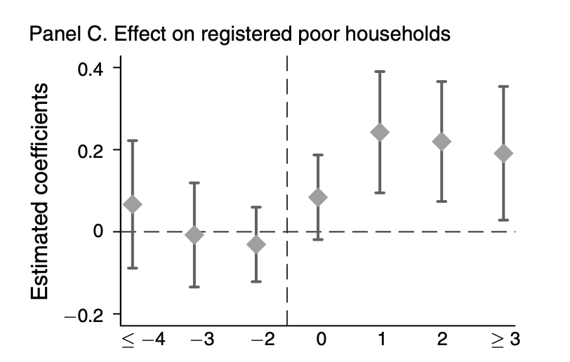
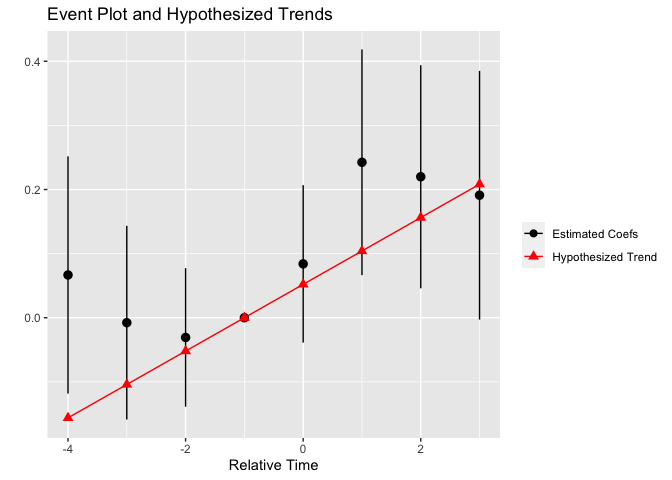
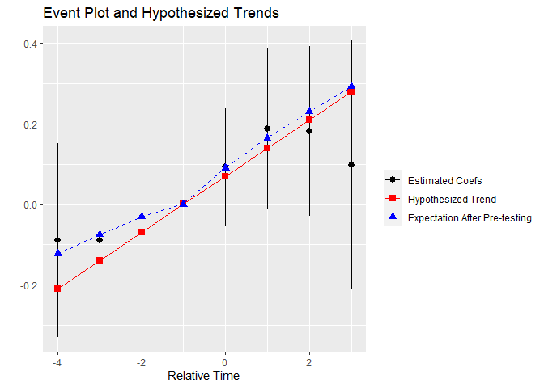
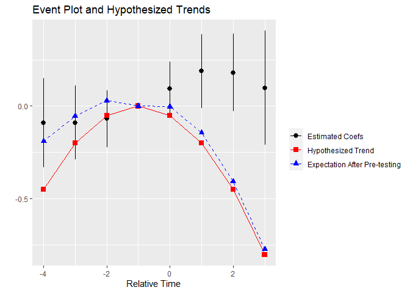

<!-- README.md is generated from README.Rmd. Please edit that file -->

# pretrends

<!-- badges: start -->

<!-- badges: end -->

The pretrends package provides tools for power calculations for
pre-trends tests, and visualization of possible violations of parallel
trends. Calculations are based on [Roth
(2020)](https://jonathandroth.github.io/assets/files/roth_pretrends_testing.pdf)
(please cite the paper if you enjoy the package\!).

## Installation

You can install the released version of pretrends from Github using the
devtools package:

``` r
# install.packages("devtools") #install devtools if not installed
devtools::install_github("jonathandroth/pretrends")
```

## Application to He and Wang (2017)

We illustrate how to use the package with an application to [He and Wang
(2017)](https://www.aeaweb.org/articles?id=10.1257/app.20160079). The
analysis will be based on the event-study in Figure 2A, which looks like
this:



### Load the package and data

We first load the pretrends package.

``` r
library(pretrends)
```

Next we load the estimation results used for the event-plot, namely the
coefficients (*beta*), the variance-covariance matrix (*sigma*), and the
corresponding event-times (*t*). In this case, these coefficients come
from a two-way fixed effects regression, but the pretrends package can
accommodate an event-study from any asymptotically normal estimator,
including [Callaway and Sant’Anna
(2020)](https://www.sciencedirect.com/science/article/pii/S0304407620303948?dgcid=author)
and [Sun and Abraham
(2020)](https://www.sciencedirect.com/science/article/abs/pii/S030440762030378X).

``` r
#Load the coefficients, covariance matrix, and time periods
beta <- pretrends::HeAndWangResults$beta
sigma <- pretrends::HeAndWangResults$sigma
tVec <- pretrends::HeAndWangResults$tVec
referencePeriod <- -1 #This is the omitted period in the regression
data.frame(t = tVec, beta = beta)
#>    t        beta
#> 1 -4 -0.08942866
#> 2 -3 -0.08939153
#> 3 -2 -0.06860359
#> 4  0  0.09308024
#> 5  1  0.18774731
#> 6  2  0.18067996
#> 7  3  0.09727819
```

### Using the package

The pretrends package has two main functions. The first is
*slope\_for\_power()*, which calculates the slope of a linear violation
of parallel trends that a pre-trends test would detect a specified
fraction of the time. (By detect, we mean that there is any significant
pre-treatment coefficient.)

``` r
#Compute slope that gives us 50% power
slope50 <-
slope_for_power(sigma = sigma,
                targetPower = 0.5,
                tVec = tVec,
                referencePeriod = referencePeriod)
slope50
#> [1] 0.06991527
```

The package’s second (and main) function is *pretrends()*, which enables
power analyses and visualization given the results of an event-study and
a user-hypothesized difference in trends. We illustrate this using the
linear trend against which pre-tests have 50 percent power, computed
above.

``` r
pretrendsResults <- 
  pretrends(betahat = beta, 
            sigma = sigma, 
            tVec = tVec, 
            referencePeriod = referencePeriod,
            deltatrue = slope50 * (tVec - referencePeriod))
```

The pretrends function returns a list of objects, which we examine in
turn. First, we can visualize the event-plot and the hypothesized trend.

``` r
pretrendsResults$event_plot
```



Next, *df\_power* displays several useful statistics about the power of
the pre-test against the hypothesized trend:

  - **Power** The probability that we would find a significant pre-trend
    under the hypothesized pre-trend. (This is 0.50 by construction in
    our example).

\-**Bayes Factor** The ratio of the probability of ‘’passing’’ the
pre-test under the hypothesized trend relative to under parallel trends.

\-**Likelihood Ratio** The ratio of the likelihood of the observed
coefficients under the hypothesized trend relative to under pararallel
trends.

``` r
pretrendsResults$df_power
#>       Power Bayes.Factor Likelihood.Ratio
#> 1 0.4997363    0.5671215        0.8589346
```

Next, *df\_eventplot* contains the data used to make the event-plot. It
also includes a column *meanAfterPretesting*, which shows the expected
value of the coefficients conditional on passing the pre-test under the
hypothesized trend.

``` r
pretrendsResults$df_eventplot
#>    t     betahat   deltatrue         se meanAfterPretesting
#> 1 -4 -0.08942866 -0.20974582 0.12228981         -0.12249504
#> 2 -3 -0.08939153 -0.13983055 0.10185069         -0.07515163
#> 3 -2 -0.06860359 -0.06991527 0.07761490         -0.03060731
#> 4 -1  0.00000000  0.00000000 0.00000000          0.00000000
#> 5  0  0.09308024  0.06991527 0.07494899          0.09017188
#> 6  1  0.18774731  0.13983055 0.10177085          0.16447429
#> 7  2  0.18067996  0.20974582 0.10727871          0.22994584
#> 8  3  0.09727819  0.27966110 0.15696300          0.29190725
```

Finally, the plot event\_plot\_pretest adds the *meanAfterPretesting* to
the original event-plot.

``` r
pretrendsResults$event_plot_pretest
```



Although our example has focused on a linear violation of parallel
trends, the package allows the user to input an arbitrary non-linear
hypothesized trend. For instance, here is the event-plot from a
quadratic trend.

``` r
  pretrends(betahat = beta, 
            sigma = sigma, 
            tVec = tVec, 
            referencePeriod = referencePeriod,
            deltatrue = -0.05 * (tVec - referencePeriod)^2)$event_plot_pretest
```


