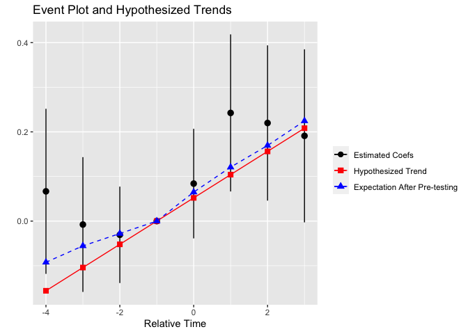
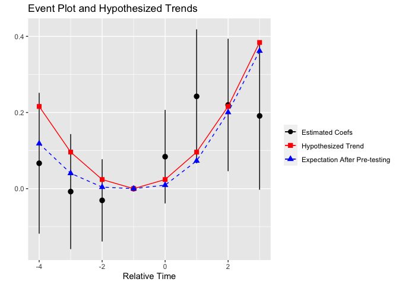

<!-- README.md is generated from README.Rmd. Please edit that file -->

# pretrends

<!-- badges: start -->

<!-- badges: end -->

The pretrends package provides tools for power calculations for
pre-trends tests, and visualization of possible violations of parallel
trends. Calculations are based on [Roth (2022,
AER:Insights)](https://jonathandroth.github.io/assets/files/roth_pretrends_testing.pdf).
(Please cite the paper if you enjoy the package!)

The basic idea is that if we are relying on a pre-trends test to verify
the parallel trends assumption, we’d like that test to have *power* to
detect relevant violations of parallel trends. To assess the power of a
pre-trends test, we can calculate its ex ante power: how big would a
violation of parallel trends need to be such that we would detect it
some specified fraction (say 80%) of the time? This is similar to the
minimal detectable effect (MDE) size commonly reported for RCTs.
Alternatively, we can calculate how likely we would be to detect a
particular hypothesized violation of parallel trends. The pretrends
package provides methods for doing these calculations, as well as for
visualizing potential violations of parallel trends on an event-study
plot.

If you’re worried about violations of parallel trends, you might also
consider the sensitivity analysis provided in the [HonestDiD
package](https://github.com/asheshrambachan/HonestDiD?tab=readme-ov-file#honestdid).
Rather than relying on the significance of a pre-test, the HonestDiD
approach imposes that the post-treatment violations of parallel trends
are not “too large” relative to the pre-treatment violations. It then
forms confidence intervals for the treatment effect that take into
account the uncertainty over how big the pre-treatment violations of
parallel trends are. (This, in my view, is a more “complete” solution to
the issue that pre-trends tests may fail to detect violations of
parallel trends.)

If you’re not an R user, you may also be interested in the associated
[Stata package](https://github.com/mcaceresb/stata-pretrends#pretrends)
or [Shiny app](https://github.com/jonathandroth/PretrendsPower).

## Installation

You can install the released version of pretrends from Github using the
devtools package:

``` r
# install.packages("devtools") #install devtools if not installed
devtools::install_github("jonathandroth/pretrends")
```

## Application to He and Wang (2017)

We illustrate how to use the package with an application to [He and Wang
(2017)](https://www.aeaweb.org/articles?id=10.1257/app.20160079). The
analysis will be based on the event-study in Figure 2C, which looks like
this:

<figure>

<figcaption aria-hidden="true">He and Wang Plot.</figcaption>
</figure>

### Load the package and data

We first load the pretrends package.

``` r
library(pretrends)
```

To use the pretrends package, we need the results of an event-study,
namely the vector of event-study coefficients (*beta*), their
variance-covariance matrix (*sigma*), and the relative time periods they
correspond to (*t*). For this example, we use the *beta* and *sigma*
saved from a two-way fixed effects regression, but the pretrends package
can accommodate an event-study from any asymptotically normal estimator,
including [Callaway and Sant’Anna
(2020)](https://www.sciencedirect.com/science/article/pii/S0304407620303948?dgcid=author)
and [Sun and Abraham
(2020)](https://www.sciencedirect.com/science/article/abs/pii/S030440762030378X).
Importing *beta* and *sigma* for the pretrends package is the same as
for the HonestDiD package; see the HonestDiD package
[README](https://github.com/asheshrambachan/HonestDiD?tab=readme-ov-file#example-usage--medicaid-expansions)
for examples using fixest, Callaway and Sant’Anna, and Sun and Abraham.

``` r
#Load the coefficients, covariance matrix, and time periods
beta <- pretrends::HeAndWangResults$beta
sigma <- pretrends::HeAndWangResults$sigma
tVec <- pretrends::HeAndWangResults$tVec
referencePeriod <- -1 #This is the omitted period in the regression
data.frame(t = tVec, beta = beta)
#>    t         beta
#> 1 -4  0.066703148
#> 2 -3 -0.007701792
#> 3 -2 -0.030769054
#> 4  0  0.084030658
#> 5  1  0.242441818
#> 6  2  0.219878986
#> 7  3  0.191092536
```

### Using the package

The pretrends package has two main functions. The first is
*slope_for_power()*, which calculates the slope of a linear violation of
parallel trends that a pre-trends test would detect a specified fraction
of the time. (By detect, we mean that there is any significant
pre-treatment coefficient.)

``` r
#Compute slope that gives us 50% power
slope50 <-
slope_for_power(sigma = sigma,
                targetPower = 0.5,
                tVec = tVec,
                referencePeriod = referencePeriod)
slope50
#> [1] 0.05205871
```

This tells us that if there were a linear pre-trend with a slope of
about 0.05, then we would find a significant pre-trend only half the
time. (Note that the result of *slope_for_power* is a magnitude, and
thus is always positive.)

The package’s second function is *pretrends()*, which enables power
analyses and visualization given the results of an event-study and a
user-hypothesized violation of parallel trends. We illustrate this using
the linear trend against which pre-tests have 50 percent power, computed
above. (This is just for illustration; we encourage researchers to
conduct power analysis for violations of parallel trends they deem to be
relevant in their context.)

``` r
pretrendsResults <- 
  pretrends(betahat = beta, 
            sigma = sigma, 
            tVec = tVec, 
            referencePeriod = referencePeriod,
            deltatrue = slope50 * (tVec - referencePeriod))
```

The pretrends function returns a list of objects, which we examine in
turn. First, we can visualize the event-plot and the hypothesized trend.

``` r
pretrendsResults$event_plot
```


Heuristically, the event-plot is more convincing if an economically
plausible violation of parallel trends cannot explain the pattern in the
event-study (e.g. go through all of the confidence intervals); see the
HonestDiD package for a formalization of this idea.

Next, *df_power* displays several useful statistics about the power of
the pre-test against the hypothesized trend:

- **Power** The probability that we would find a significant pre-trend
  under the hypothesized pre-trend. (This is 0.50, up to numerical
  precision error, by construction in our example). Higher power
  indicates that we would be likely to find a significant pre-treatment
  coefficient under the hypothesized trend.

- **Bayes Factor** The ratio of the probability of “passing” the
  pre-test under the hypothesized trend relative to under parallel
  trends. The smaller the Bayes factor, the more we should update our
  prior in favor of parallel trends holding (relative to the
  hypothesized trend) if we observe an insignificant pre-trend.

- **Likelihood Ratio** The ratio of the likelihood of the observed
  coefficients under the hypothesized trend relative to under parallel
  trends. If this is small, then observing the event-study coefficient
  seen in the data is much more likely under parallel trends than under
  the hypothesized trend.

``` r
pretrendsResults$df_power
#>       Power Bayes.Factor Likelihood.Ratio
#> 1 0.4999776      0.56901        0.1057627
```

Next, *df_eventplot* contains the data used to make the event-plot. It
also includes a column *meanAfterPretesting*. The basic idea of this
column is that if we only analyze our event-study conditional on not
finding a significant pre-trend, we are analyzing a selected subset of
the data. The *meanAfterPretesting* column tells us what we’d expect the
coefficients to look like *conditional on not finding a significant
pre-trend* if in fact the true pre-trend were the hypothesized trend
specified by the researcher.

``` r
pretrendsResults$df_eventplot
#>    t      betahat   deltatrue         se meanAfterPretesting
#> 1 -4  0.066703148 -0.15617613 0.09437463         -0.09230764
#> 2 -3 -0.007701792 -0.10411742 0.07705139         -0.05555285
#> 3 -2 -0.030769054 -0.05205871 0.05512372         -0.02790950
#> 4 -1  0.000000000  0.00000000 0.00000000          0.00000000
#> 5  0  0.084030658  0.05205871 0.06264775          0.06490184
#> 6  1  0.242441818  0.10411742 0.08981034          0.12084694
#> 7  2  0.219878986  0.15617613 0.08877826          0.16946498
#> 8  3  0.191092536  0.20823484 0.09893648          0.22453827
```

Finally, the plot event_plot_pretest adds the *meanAfterPretesting* to
the original event-plot (see description above).

``` r
pretrendsResults$event_plot_pretest
```



Although our example has focused on a linear violation of parallel
trends, the package allows the user to input an arbitrary non-linear
hypothesized trend. For instance, here is the event-plot and power
analysis from a quadratic trend.

``` r
  quadraticPretrend <-
  pretrends(betahat = beta, 
            sigma = sigma, 
            tVec = tVec, 
            referencePeriod = referencePeriod,
            deltatrue = 0.024 * (tVec - referencePeriod)^2)

quadraticPretrend$event_plot_pretest
```



``` r
quadraticPretrend$df_power
#>       Power Bayes.Factor Likelihood.Ratio
#> 1 0.6624282    0.3841516        0.4332635
```
